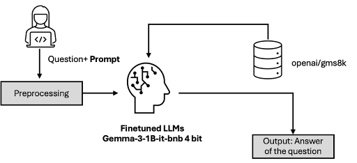
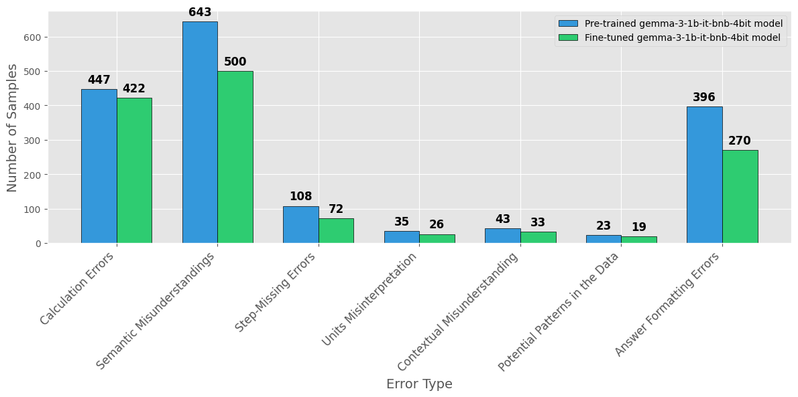

# Reinforcement Learning Evokes Reasoning in Small Language Models

## Project Overview

**Team Name:** Digital Dragons

**Contributors:** Abhay Nandiraju, Ayesha Khatun, Maksim Kulik, Matthew Hernandez

This project explores the application of reinforcement learning (RL) for enhancing the logical reasoning abilities of small language models (LLMs). We experiment with fine-tuning a reasoning model using reinforcement learning and track its progress by evaluating it on the GSM8K benchmark. The goal is to assess whether LLMs are capable of true logical reasoning.

## Project Structure
```bash
	│── experiments/	     		# Experiments for quantitative analysis
	│── logs/
	│   ├── pretrained_results/     	# .csv file for the predictions of pretrained model
	│   └── finetuned_results/     		# .csv file for the predictions of finetuned model
 	│── notebooks/
	│   ├── exploratory/         		# Error analysis
	│   └── reproducibility/    		# Code for replication of experiments	
	│── pics/				# PNG files for repository
	│── src/
	│   └── tasks/               		# Helper task for modular coding
	│── tests/                   		# Unit & integration tests
	│── INFO 621 Final Project.pdf  	# Project report
	│── README.md                		# Project overview and setup instructions
	│── project_charter.txt      		# Short document stating project details
	│── requirements.txt         		# Requirements for project (unused)
```

## Prequisites & Setup
The code must be run with a GPU only because of Unsloth's requirements, and we recommend using Google Colab to run the inference notebook to a preselected sample from the dataset.

To run inference on Google Colab, follow the steps below:
1. Go to the ```src/notebooks/gemma_3_final_inference.ipynb``` notebook [here](https://github.com/srikrish2812/info621_project/blob/main/src/notebooks/gemma_3_final_inference.ipynb) and click "Open in Colab".
2. Click the Connect / Reconnect T4 button. T4 is a free GPU that is provided by Google. Compute units are finite but sufficient to run our example.
3. Click the play buttom until the end of the section header ```Inference``` where the stdout prints out "Code demonstration finished!" to conclude the setup.

## Quick Start
The following code is from the ```src/notebooks/gemma_3_final_inference.ipynb``` notebook and runs inference on a preselected example:

```Python
model_output = run_model(sample['prompt'], measure_p=False)
```
And the output would be something like the response below (note the LLM is not deterministic, and may output an incorrect response):
```
<bos><bos><start_of_turn>user

<start_of_turn>user
Solve the following math problem step-by-step:
{question}<end_of_turn>
<start_of_turn>model


Natalia sold clips to 48 of her friends in April, and then she sold half as many clips in May. How many clips did Natalia sell altogether in April and May?<end_of_turn>
<start_of_turn>model
Let $C$ be the number of clips Natalia sold in April.
Let $M$ be the number of clips Natalia sold in May.

Natalia sold clips to 48 of her friends in April, so she sold 48 clips in April.
So, $C = 48$.
In May, she sold half as many clips as in April. So, $M = \frac{1}{2}C = \frac{1}{2} \times 48 = 24$.
So, Natalia sold 24 clips in May.
The total number of clips sold in April and May is $C + M = 48 + 24 = 72$.

Thus, Natalia sold 72 clips altogether in April and May.

Final Answer: The final answer is $\boxed{72}$<end_of_turn>
```
## Error Analysis


## Acknowledgements
We thank [Unsloth](https://docs.unsloth.ai/) for making it easy to train the Gemma-3 1B model on the Google Colab platform. Their boilerplate [code](https://colab.research.google.com/github/unslothai/notebooks/blob/main/nb/Gemma3_(1B)-GRPO.ipynb) was modified for our custom model. Lastly, the citations for the model and datasets are provided below:
```
@article{gemma_2025,
    title={Gemma 3},
    url={https://goo.gle/Gemma3Report},
    publisher={Kaggle},
    author={Gemma Team},
    year={2025}
}
```
```
@article{cobbe2021gsm8k,
  title={Training Verifiers to Solve Math Word Problems},
  author={Cobbe, Karl and Kosaraju, Vineet and Bavarian, Mohammad and Chen, Mark and Jun, Heewoo and Kaiser, Lukasz and Plappert, Matthias and Tworek, Jerry and Hilton, Jacob and Nakano, Reiichiro and Hesse, Christopher and Schulman, John},
  journal={arXiv preprint arXiv:2110.14168},
  year={2021}
}

```
